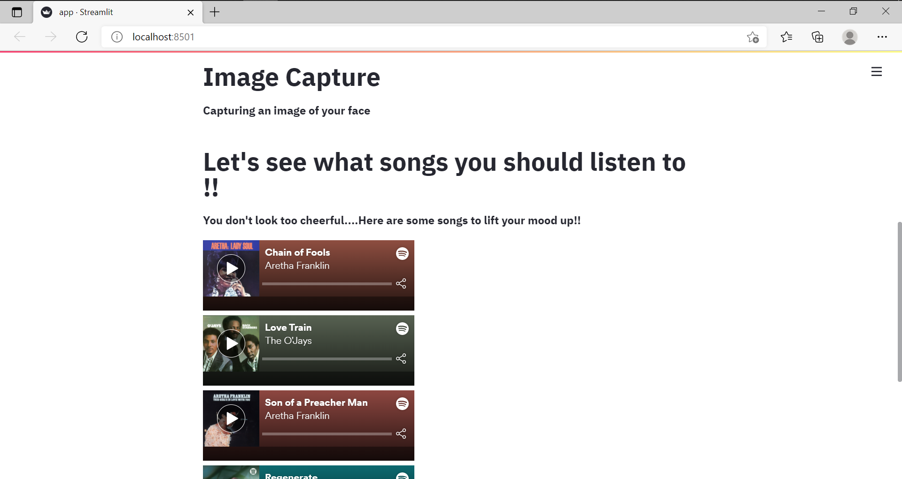

</img>
#### Theme : Mental Wellness

### Introduction

Music Heals the Soul is a Smart Application that recommends songs from Spotify of a particular genre based on the real time emotions of the user.

### Technologies 
- Casscade Classifiers and Webcam input from OpenCV
- A Lightweight Face Recognition and Facial Attribute Analysis Framework Deepface for Emotion Recognition
- Spotify API to fetch songs and playlists based on emotions
- App deployed using Streamlit Python Library

### How DeepFace Work?
Deepface is a hybrid face recognition package. It currently wraps the state-of-the-art face recognition models: VGG-Face , Google FaceNet, OpenFace, Facebook DeepFace, DeepID, ArcFace and Dlib. The default configuration verifies faces with VGG-Face model. You can set the base model while verification as illustared below.

FaceNet, VGG-Face, ArcFace and Dlib overperforms than OpenFace, DeepFace and DeepID based on experiments. Supportively, FaceNet got 99.65%; ArcFace got 99.40%; Dlib got 99.38%; VGG-Face got 98.78%; OpenFace got 93.80% accuracy scores on LFW data set whereas human beings could have just 97.53%.

### How to Run the application:
Make sure you have all the dependencies mentioned in requirements.txt
- Go to the terminal and run the command `streamlit run app.py`

### Screenshots

